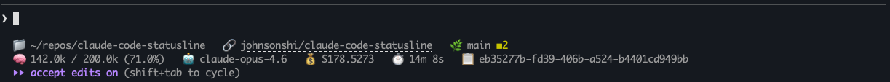

# claude-code-statusline

A customizable two-line status bar script for [Claude Code](https://claude.com/claude-code) CLI that shows git status, context window usage, model info, cost tracking, and more.

## Screenshot



## Features

**Line 1 — Git & workspace:**
- 📁 Current working directory (with `~` shortening)
- 🔗 Clickable GitHub repo link ([OSC 8](https://en.wikipedia.org/wiki/ANSI_escape_code#OSC) — Cmd+click in iTerm2)
- 🌿 Git branch with oh-my-zsh style status symbols

**Line 2 — Session info:**
- 🧠 Context window usage derived from `used_percentage` (accurate, not cumulative)
- 🤖 Model ID
- 💰 Session cost
- ⏱️ API time
- 📋 Session ID

### Git status symbols

| Symbol | Meaning | Color |
|--------|---------|-------|
| ✚ | Staged files | Yellow |
| ✱ | Modified files (unstaged) | Yellow |
| ✖ | Deleted files (unstaged) | Yellow |
| ➜ | Renamed files (staged) | Yellow |
| ◼ | Untracked files | Yellow |
| ═ | Merge conflicts | Yellow |
| ⚡ | Stash entries | Default |
| ⬆ | Commits ahead of remote | Default |
| ⬇ | Commits behind remote | Default |

## Requirements

- [jq](https://jqlang.github.io/jq/) — for parsing JSON from stdin
- Git — for branch/status info
- A terminal that supports OSC 8 for clickable links (iTerm2, Kitty, WezTerm)

## Installation

1. Copy the script to your Claude config directory:

```bash
cp statusline.sh ~/.claude/statusline.sh
chmod +x ~/.claude/statusline.sh
```

2. Add the following to `~/.claude/settings.json`:

```json
{
  "statusLine": {
    "type": "command",
    "command": "~/.claude/statusline.sh"
  }
}
```

3. The status line will appear after your next interaction with Claude Code.

## How it works

Claude Code pipes JSON session data to the script via stdin on every update (after each assistant message, debounced at 300ms). The script extracts fields with `jq`, runs cached git commands, and prints two lines to stdout.

Git operations (branch, status, remote URL) are cached to `/tmp/statusline-git-cache` with a 5-second TTL to avoid lag in large repositories.

For full details on the status line API, see the [Claude Code statusline docs](https://code.claude.com/docs/en/statusline).

## Testing

Test with mock JSON input:

```bash
echo '{"model":{"id":"claude-opus-4-6","display_name":"Opus"},"workspace":{"current_dir":"/Users/you/project"},"cost":{"total_cost_usd":0.05,"total_api_duration_ms":30000},"context_window":{"context_window_size":200000,"used_percentage":25.0},"session_id":"test123"}' | ./statusline.sh
```

## License

MIT
